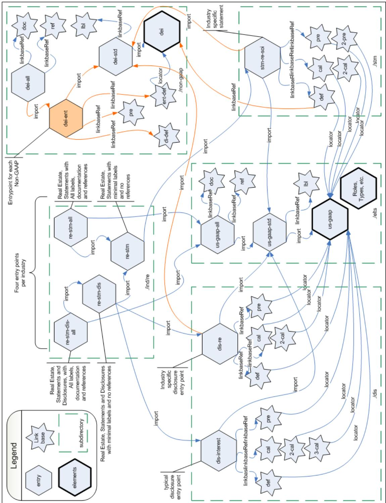

## US GAAP Financial Statement Taxonomy Project

# XBRL US GAAP Taxonomies v1.0 Technical Guide

Document Number: SECOFM-USGAAPT-TechnicalGuide

**Version 1.0 April 28, 2008** 

Prepared by:

#### **Mark Bolgiano**  President and CEO

XBRL US, Inc

**Campbell Pryde**  Director of Standards XBRL US, Inc. **Walter Hamscher**  President and CEO, Standard Advantage

### **Notice Authorized Uses of this Document**

Copyright © 2008 XBRL US, Inc.

All Rights Reserved

In order to meet the SEC's mission requirements, the U.S. GAAP Financial Statement Taxonomy may be used by the public, royalty-free, in U.S. GAAP reporting, and may be incorporated without change in other works that comment on, explain, or assist in the use or implementation of the U.S. GAAP Financial Statement Taxonomy.

To that end, this document and translations of it may be copied and furnished to others, in whole or in part, and this document may be incorporated, in whole or in part, without change in other works that comment on or otherwise explain the U.S. GAAP Financial Statement Taxonomy or assist in its implementation. Other works that incorporate this document, in whole or in part, without change may be prepared, copied, published and distributed without restriction of any kind, provided this Notice is included on the first page of all such authorized copies and works and the legend set forth below is contained on each subsequent page of such documents. Under no circumstances may this document, or any part of it that is incorporated into another work, be modified in any way, such as by removing the copyright notice or references to XBRL US, Inc., except as required to translate it into languages other than English or with prior written consent of XBRL US, Inc.

XBRL US, Inc. owns all right, title and interest in the U.S. GAAP Financial Statement Taxonomy and all technical data, software, documentation, manuals, instructional materials, and other information created in connection with the U.S. GAAP Financial Statement Taxonomy – which includes this document. The SEC has an unlimited license in the GAAP Financial Statement Taxonomy and this other information and materials pursuant to Federal Acquisition Regulation ("FAR") 52.227-11, 52.227-14 (Alternative IV) and 52.227-16.

The following legend shall appear on each subsequent page:

#### **Notice Authorized Uses Are Set Forth on the First Page of this Document/File Copyright © 2008 XBRL US, Inc. All Rights Reserved**

### **Table of Contents**

| 1 |     | Introduction 1                                                     |  |
|---|-----|--------------------------------------------------------------------|--|
| 2 |     | Physical location and organization 2                               |  |
|   | 2.1 | Naming Conventions 2                                               |  |
|   | 2.2 | The Base Schema us-gaap-2008-03-31.xsd 4                           |  |
|   | 2.3 | References and the Reference Linkbase4                             |  |
|   | 2.4 | Documentation and the Documentation Linkbase5                      |  |
|   | 2.5 | Labels and the Label Linkbase 6                                    |  |
|   | 2.6 | Calculation, Definition, and Presentation Linkbases 7              |  |
| 3 |     | Discoverable Taxonomy Sets 7                                       |  |
| 4 |     | Namespace Prefixes, Namespace URIs, absolute and Relative URLs  10 |  |
| 5 |     | Presentation Linkbases are for Viewing the Taxonomy  10            |  |
| 6 |     | Calculations, Definitions are aligned to Presentation  11          |  |
| 7 |     | Negating Labels  13                                                |  |
|   | 7.1 | Goal 13                                                            |  |
|   | 7.2 | Negating Labels definitions  13                                    |  |
|   | 7.3 | Preparers' Perception of Signs  14                                 |  |
|   | 7.4 | Negating Labels control sign conventions line-by-line  15          |  |
|   | 7.5 | Discussion of Negating Labels  17                                  |  |
|   | 7.6 | Data Import and Export are not impacted by Negating Labels 18      |  |
|   | 7.7 | Technical Compliance for Negating Labels 18                        |  |
| 8 |     | References (non-normative)  20                                     |  |
| 9 |     | Appendices  21                                                     |  |
|   | 9.1 | Appendix A: Signature and Document Tracking Page 22                |  |

### **Table of Figures**

| Figure 3. Entry point types3<br>Figure 4. Statement type abbreviations 3<br>Figure 5. Industry abbreviations 3<br>Figure 6. Prefixes for the main file groups 3<br>Figure 7. Linkbase naming abbreviations4<br>Figure 8. Testing Entry Points4<br>Figure 9. Version 1.0 beta 2 Compliance with FRTA 2.1.12, a rule that requires concepts to<br>have documentation or reference. 5<br>Figure 10. Mandatory relationship of standard label suffix to concept type 6<br>Figure 11. Schematic of import and linkbaseRef relationships among files 8 |  |
|--------------------------------------------------------------------------------------------------------------------------------------------------------------------------------------------------------------------------------------------------------------------------------------------------------------------------------------------------------------------------------------------------------------------------------------------------------------------------------------------------------------------------------------------------|--|
| Figure 12. Four entry points per industry 9                                                                                                                                                                                                                                                                                                                                                                                                                                                                                                      |  |
| Figure 13. Entry points for non-GAAP taxonomies 9<br>Figure 14. Facts in a sample statement of income.  11                                                                                                                                                                                                                                                                                                                                                                                                                                       |  |
| Figure 15. Presentation and Calculation are aligned  12                                                                                                                                                                                                                                                                                                                                                                                                                                                                                          |  |
| Figure 16. Role definitions  13                                                                                                                                                                                                                                                                                                                                                                                                                                                                                                                  |  |
| Figure 17. Desired presentation  14<br>Figure 18. Without Negating Labels, Preparers are likely to flip signs  15                                                                                                                                                                                                                                                                                                                                                                                                                                |  |
| Figure 19. Negating Labels identified  16                                                                                                                                                                                                                                                                                                                                                                                                                                                                                                        |  |
| Figure 20. Corrected Instance.  17                                                                                                                                                                                                                                                                                                                                                                                                                                                                                                               |  |
| Figure 21. Schema declaration for negating labels  19                                                                                                                                                                                                                                                                                                                                                                                                                                                                                            |  |

### **1 Introduction**

The purpose of this document is to detail the XBRL US GAAP Taxonomies v1.0 (version 1.0). The intended audience of this document is a technical user familiar with XBRL, other specifications and modules of XBRL, XML Schema and XSLT stylesheets, etc. It is not intended as a tutorial. Business users may be interested in this document and it is written such that a business user familiar with the technologies (XBRL, XML Schema, XSLT, etc) will be comfortable with this document.

Terminology used in XBRL frequently overlaps with terminology from other fields.

| Term                                                                                                                                                                                                                                                | Meaning                                                                                                                                                                                                                                                                                                                                                                                                                                                                                                                                                                                                                                               |
|-----------------------------------------------------------------------------------------------------------------------------------------------------------------------------------------------------------------------------------------------------|-------------------------------------------------------------------------------------------------------------------------------------------------------------------------------------------------------------------------------------------------------------------------------------------------------------------------------------------------------------------------------------------------------------------------------------------------------------------------------------------------------------------------------------------------------------------------------------------------------------------------------------------------------|
| arcroleRef, child, concept, context,<br>duplicate item, descendant, DTS,<br>duplicate tuple, element, entity,<br>fact, footnote, instance, item,<br>linkbase, linkbaseRef, period,<br>roleRef, schemaRef, taxonomy,<br>taxonomy schema, tuple, unit | As defined in [XBRL].                                                                                                                                                                                                                                                                                                                                                                                                                                                                                                                                                                                                                                 |
| DTS Component                                                                                                                                                                                                                                       | A discoverable taxonomy set (DTS) contains taxonomy<br>schemas and linkbases. The bounds of a DTS are such<br>that DTS Components include all taxonomy schemas<br>and linkbases that can be discovered by following links<br>or references in the taxonomy schemas and linkbases<br>included in the DTS.                                                                                                                                                                                                                                                                                                                                              |
| MUST, MUST NOT, REQUIRED,<br>SHALL, SHALL NOT, SHOULD,                                                                                                                                                                                              | See [RFC2119] for definitions of these and other terms.<br>These include, in particular:                                                                                                                                                                                                                                                                                                                                                                                                                                                                                                                                                              |
| SHOULD NOT, MAY, OPTIONAL                                                                                                                                                                                                                           | SHOULD                                                                                                                                                                                                                                                                                                                                                                                                                                                                                                                                                                                                                                                |
|                                                                                                                                                                                                                                                     | Conforming<br>documents<br>and<br>applications<br>are<br>encouraged to behave as described.                                                                                                                                                                                                                                                                                                                                                                                                                                                                                                                                                           |
|                                                                                                                                                                                                                                                     | MUST                                                                                                                                                                                                                                                                                                                                                                                                                                                                                                                                                                                                                                                  |
|                                                                                                                                                                                                                                                     | Conforming documents and consuming applications are<br>required to behave as described; otherwise they are in<br>error.                                                                                                                                                                                                                                                                                                                                                                                                                                                                                                                               |
| FAF, FASB                                                                                                                                                                                                                                           | Financial Accounting Foundation. Financial Accounting<br>Standards Board                                                                                                                                                                                                                                                                                                                                                                                                                                                                                                                                                                              |
| Financial report                                                                                                                                                                                                                                    | A<br>document<br>containing<br>quantitative<br>and<br>textual<br>information that<br>is<br>either:<br>(1)<br>meant<br>to<br>satisfy<br>authoritative<br>financial<br>reporting<br>standards<br>and<br>generally accepted accounting principles/practices (or<br>GAAP), or a regulatory report whose subject matter is<br>primarily<br>financial<br>position<br>and<br>performance<br>and<br>related explanatory disclosures, or (b) is a data set<br>used in the collection of financial statistics. This term<br>excludes transaction, or journal-level, reporting, and<br>primarily<br>narrative<br>or<br>non-financial<br>quantitative<br>reports. |
| FRTA                                                                                                                                                                                                                                                | Financial Reporting Taxonomy Architecture [FRTA].                                                                                                                                                                                                                                                                                                                                                                                                                                                                                                                                                                                                     |
| FRIS                                                                                                                                                                                                                                                | Financial Reporting Instance Standards.                                                                                                                                                                                                                                                                                                                                                                                                                                                                                                                                                                                                               |

| Term                 | Meaning                                                                                                                                                                                                                           |
|----------------------|-----------------------------------------------------------------------------------------------------------------------------------------------------------------------------------------------------------------------------------|
| GAAP or US GAAP      | Generally Accepted Accounting Principles: Term used to<br>describe broadly the body of principles/practices that<br>govern the accounting for financial transactions in the<br>preparation of a set of financial statements       |
| IASB                 | International Accounting Standards Board                                                                                                                                                                                          |
| IFRS                 | International Financial Reporting Standards                                                                                                                                                                                       |
| PCAOB                | Public Company Accounting Oversight Board                                                                                                                                                                                         |
| XBRL                 | Extensible Business Reporting Language (XBRL) 2.1<br>Recommendation [XBRL].                                                                                                                                                       |
| SEC                  | US Securities and Exchange Commission                                                                                                                                                                                             |
| VFP                  | SEC Voluntary Filing Program                                                                                                                                                                                                      |
| Version 1.0          | XBRL US GAAP Taxonomies v1.0                                                                                                                                                                                                      |
| Development Taxonomy | Details of the taxonomy that, while it is being<br>developed,<br>may<br>differ<br>from<br>its<br>final<br>syntax<br>as<br>published. A development taxonomy will generally align<br>to the logical model but not to the physical. |

### **2 Physical location and organization**

The taxonomies are rooted at URLs of the form http://xbrl.us/us-gaap/{version}/ and the current taxonomies are specifically at the base URL

```
http://xbrl.us/us-gaap/1.0/
```
A zip file containing all files is located at

http://xbrl.us/documents/XBRLUSGAAPTaxonomies-2008-03-31.zip

There are dozens of entry points for different purposes. Each entry point selects some subset of the 587 files constituting all taxonomies.

### *2.1 Naming Conventions*

**Figure 1. Directories for entry point schemas** 

| dis      | disclosures                                      |
|----------|--------------------------------------------------|
| elts     | elements                                         |
| ind      | industries                                       |
| non-gaap | non-GAAP taxonomies, each with its own namespace |
| stm      | statements                                       |
| test     | test related material                            |

#### **Figure 2. Abbreviations used in file names**

| -all- | load full taxonomy with documentation and references for concepts, |
|-------|--------------------------------------------------------------------|
|       | yielding a minimum DTS size of 59 MB.                              |

| -std- | load a taxonomy with no documentation or references, yielding a |  |
|-------|-----------------------------------------------------------------|--|
|       | minimum DTS size of approximately 43 MB                         |  |

#### **Figure 3. Entry point types**

| -ent- | a document schema entry point  |
|-------|--------------------------------|
| -stm- | a statement schema or linkbase |

#### **Figure 4. Statement type abbreviations**

| -com- | common                               | Contains definition and other arcs whose only purpose is<br>to be copied by users into other links. |
|-------|--------------------------------------|-----------------------------------------------------------------------------------------------------|
| -scf- | statement of cash flows              |                                                                                                     |
| -scp- | statement of partner<br>capital      |                                                                                                     |
| -sfp- | statement of financial<br>position   | Also known as a balance sheet                                                                       |
| -she- | statement of shareholder<br>equity   |                                                                                                     |
| -soc- | statement of<br>comprehensive income |                                                                                                     |
| -soi- | statement of income                  |                                                                                                     |

#### **Figure 5. Industry abbreviations**

| -basi-<br>-bd- | banking and savings<br>broker-dealer |
|----------------|--------------------------------------|
|                |                                      |
| -ci-           | commercial and industrial            |
| -ins-          | insurance                            |
| -re-           | real estate                          |

#### **Figure 6. Prefixes for the main file groups**

| currency-<br>dei-<br>exch- | Currency<br>Document and entity information<br>Exchange codes |
|----------------------------|---------------------------------------------------------------|
| mda-                       | Management discussion and analysis                            |
| mr-<br>mr-                 | Management report<br>Management report                        |
| naics-<br>seccert-         | NAICS<br>SEC certification                                    |
| sic-                       | Standardized Industry Codes                                   |
| stpr-                      | State or Province code                                        |
| us-gaap-                   | US GAAP taxonomy prefix                                       |

| -cal- | calculation                                                      |
|-------|------------------------------------------------------------------|
| -def- | definition                                                       |
| -doc- | documentation (contains xbrl labels having role "documentation") |
| -lab- | labels (contains labels having standard role "label")            |
| -pre- | presentation                                                     |
| -ref- | reference                                                        |

#### **Figure 7. Linkbase naming abbreviations**

The following schemas are provided *only for vendor testing*. The DTS loaded from these entry points will have redundant (though not technically inconsistent) calculation, definition and presentation arcs, and performance in some tools consequently suffers. These entry points are normally never exposed to end users particularly preparers.

#### **Figure 8. Testing Entry Points**

| us-gaap-entryPoint-std-2008-03-31.xsd | DTS includes all components in all folders except<br>for -doc- and -ref- linkbases. |
|---------------------------------------|-------------------------------------------------------------------------------------|
| us-gaap-entryPoint-all-2008-03-31.xsd | DTS includes all components in all folders.                                         |
| dei-entryPoint-std-2008-03-31.xsd     | DTS includes DEI and related components except<br>for -doc- and -ref- linkbases     |
| dei-entryPoint-all-2008-03-31.xsd     | DTS includes DEI and related components.                                            |

### *2.2 The Base Schema us-gaap-2008-03-31.xsd*

There are 15,006 concepts in the taxonomies, of which 12,676 are non-abstract concepts and the rest are abstracts appearing in dimensional links, presentation headings. All concepts in the US GAAP taxonomy are concentrated in a single file for reasons explained in the architecture document and are summarized here:

- Preparers need access to the full set of available concepts whenever searching for a concept, so that they do not unnecessarily extend the taxonomy. Avoiding unnecessary extensions is in the interest of all parties in the supply chain.
- Linkages between statements, statements and disclosures, and among disclosures are sufficiently dense that naïve strategies based on (say) industry concepts or concepts in different statements wind up loading everything anyway.
- The minimum 9 MB load, because it contains only one label linkbase, is normally quite fast relative to the processing involved in validating an equivalent set of calculation, definition or presentation arcs.

The team experimented with alternative serializations that would break this one file into smaller files. This would use the schema "include" element rather than the "import", so as to retain an important feature, namely, a single namespace for all GAAP concepts. One promising alternative would place all concepts appearing in any Statement linkbase into a single file, and the rest into another file. Unfortunately, the set of "Statement concepts" of around 3000 most commonly used concepts is still quite large.

### *2.3 References and the Reference Linkbase*

References to authoritative literature appear on most GAAP concepts. References sufficient to understand the concept are provided, not references to all occurrences to a concept having relevant GAAP literature.

The file us-gaap-ref-2008-03-31.xml contains a legal XLink construct that has not commonly been leveraged in XBRL taxonomies. There is only a single reference resource element for each distinct reference, so that if several concepts share a literature reference, they each have an arc pointing to the common resource. This saves about 40% on the size of that one file. Therefore, when doing taxonomy editing, users will need to have the choice of editing the reference (and thereby impacting all concepts that use it) or editing a copy of it (thus impacting just a single concept).

Reference resources do not have id attributes. Therefore, the arc between the concept and its references cannot be prohibited by any extension linkbase.

### *2.4 Documentation and the Documentation Linkbase*

The file us-gaap-doc-2008-03-31.xml and other documentation label files contain label resources with the "documentation" role and concept-label arcs for 12,994 of the 14,998 concepts. Labels and documentation linkbases are NOT referenced from the base schema (us-gaap-2008-01-31.xsd), so users have the option whether or not to load this linkbase. It is almost 9MB.

FRTA 1.0 rules 2.1.10 and 2.1.12 are of particular interest. When FRTA 1.0 was written we were not anticipating 10,000+ element taxonomies. XBRL US GAAP Taxonomies 1.0 delivers all the content and complies with the spirit of the rule. However, the overhead is not forced on a user if all they want to do is validation and processing without display. Therefore, a FRTA validation will yield thousands of violations of rule 2.1.10 and 2.1.12.

| FRTA<br>Section<br>2.1.10 | Rule<br>An element must have a<br>standard label in the DTS of<br>the schema where it is defined.        | Remarks<br>To give users maximum flexibility, the base<br>schema us-gaap does not reference any<br>linkbases. The schema us-gaap-std links to the<br>standard labels and imports the us-gaap base<br>schema. |
|---------------------------|----------------------------------------------------------------------------------------------------------|--------------------------------------------------------------------------------------------------------------------------------------------------------------------------------------------------------------|
| 2.1.12                    | An element must have a<br>documentation or reference in<br>the DTS of the schema where<br>it is defined. | Similarly, us-gaap-all links to the references and<br>documentation, and imports the us-gaap-std<br>taxonomy which contains the standard labels.                                                             |

**Figure 9. Version 1.0 Compliance with FRTA 2.1.12, a rule that requires concepts to have documentation or reference.** 

|                |          | Concepts<br>with | No            |
|----------------|----------|------------------|---------------|
| Namespace      | Concepts | Documentation    | Documentation |
| us-gaap        | 12,126   | 10,479           | 1,647         |
| ar             | 43       | 43               | -             |
| country        | 255      | 254              | 1             |
| currency       | 172      | -                | 172           |
| dei            | 135      | 135              | -             |
| exch           | 535      | 535              | -             |
| mda            | 69       | 69               | -             |
| mr             | 18       | 18               | -             |
| naics          | 1,196    | 1,196            | -             |
| seccert        | 58       | 58               | -             |
| sic            | 459      | 459              | -             |
| stpr           | 65       | 64               | 1             |
| (All non-gaap) | 3,005    | 2,831            | 174           |
| Union          | 15,131   | 13,310           | 1,821         |

Documentation label resources do not have id attributes. Therefore, the arc between the concept and its documentation cannot be prohibited by any extension linkbase.

### *2.5 Labels and the Label Linkbase*

File us-gaap-lab-2008-03-31.xml contains the "standard" labels for all concepts in the base schema us-gaap-2008-03-31.xsd.

Standard label resources *do* have id attributes. Therefore, the arc between the concept and its documentation may be prohibited by any extension linkbase.

A standard label with a bracketed suffix completely determines the type, substitution group, period, and whether a concept is abstract. All abstract concepts must have one of these bracketed suffixes.

| Suffix         | Type                    | Substitution Group   | Abstract | Period   |
|----------------|-------------------------|----------------------|----------|----------|
| [Abstract]     | xbrli:string            | xbrli:item           | Abstract | duration |
| [Domain]       | us-types:domainItemType | xbrli:item           |          | duration |
| [Member]       | us-types:domainItemType | xbrli:item           |          | duration |
| [Line Items]   | xbrli:string            | xbrli:Item           | Abstract | duration |
| [Table]        | xbrli:stringItemType    | xbrldt:hypercubeItem | Abstract | duration |
| [Axis]         | xbrli:stringItemType    | xbrli:dimensionItem  | Abstract | duration |
| [Roll Forward] | xbrli:string            | xbrli:item           | Abstract | duration |

**Figure 10. Mandatory relationship of standard label suffix to concept type** 

### **2.5.1 Legacy Element Names**

Over 700 concepts from an earlier US GAAP XBRL taxonomy dated 2005-02-28 were used by one or more XBRL instances filed under the SEC's Voluntary Filing Program. Their element names were preserved where there was corresponding concept in XBRL US Taxonomies version 1.0. Experience shows now that correspondence of the element name to standard label is of critical importance to preparers throughout their tagging and verification processes. Therefore, for all concepts in 1.0 beta 2 and 1.0, the element names in the us-gaap, mda, mr and ar namespaces are constructed from the Standard Label as follows: apply Proper Case to all words and remove all characters not in the set [a-zA-Z0-9]. Based on taxonomy changes after the 1.0 beta release, the standard label of a concept often change and therefore its element name would also change.

See the release notes for the 1.0 beta 2 release regarding a master file of 1541 items that indicates elements added, changed and deleted between 1.0 beta and 1.0 beta 2; the columns are as follows:

| A - Added<br>C - Changed                                                                                                                                             |
|----------------------------------------------------------------------------------------------------------------------------------------------------------------------|
| VAC<br>VAC1 - Present in July 2007 "Voluntary Filer Active Concepts" list<br>VAC2 - Used by any voluntary filer through 31 January 2008<br>(Blank) - On neither list |
| Old                                                                                                                                                                  |
| Namespace http://xbrl.us/us-gaap/2008-01-31                                                                                                                          |
| New                                                                                                                                                                  |
| Namespace http://xbrl.us/us-gaap/2008-03-31                                                                                                                          |

The correspondence of old and new element name is often accompanied by other changes such as calculation or presentation relationships; however, in any case marked as a "change",

the documentation label and the references were verified by taxonomy editors to be semantically equivalent.

From March 2005 through 31 January 2007, instance documents furnished to the SEC in the Voluntary Filing Program used 852 elements from the US GAAP taxonomies dated 2005-02-28 and 2005-06-28 (the "2005 Elements"). A partial mapping of 335 of these 852 legacy elements are also provided in the 1.0 Beta 2 Release Notes.

The 1.0 Release Notes include six similarly formatted files that document the correspondence between the 1.0 beta 2 release and the 1.0 final. The files are:

| Filename                                         | Namespaces Covered                                     |
|--------------------------------------------------|--------------------------------------------------------|
| non-gaap-1.0beta2-vs-1.0-<br>ChangedElements.xls | http://xbrl.us/{ar,dei,mda,mr,seccert}/2008-{01,03}-31 |
| non-gaap-1.0beta2-vs-1.0-<br>CreatedElements.xls | http://xbrl.us/{ar,dei,mda,mr,seccert}/2008-{01,03}-31 |
| non-gaap-1.0beta2-vs-1.0-<br>DeletedElements.xls | http://xbrl.us/{ar,dei,mda,mr,seccert}/2008-{01,03}-31 |
| us-gaap-1.0beta2-vs-1.0-<br>ChangedElements.xls  | http://xbrl.us/us-gaap/2008-{01,03}-31                 |
| us-gaap-1.0beta2-vs-1.0-<br>CreatedElements.xls  | http://xbrl.us/us-gaap/2008-{01,03}-31                 |
| us-gaap-1.0beta2-vs-1.0-<br>DeletedElements.xls  | http://xbrl.us/us-gaap/2008-{01,03}-31                 |

### **2.5.2 Negating Labels**

Version 1.0 defines four new label resource roles, "Negated", "Negated Total", "Negated Period Start" and "Negated Period End". These arc roles indicate in a presentation linkbase that when a figure is displayed it should be presented multiplied by -1. This "sign flip" also normally requires a change in the label. When the labels appear as the preferred label of a presentation arc, a conforming processor will not only present the target concept with the specified label (XBRL semantics) but will also present the values of the facts negated (semantics of the Negating Labels specification). The full Negating Labels specification appears as section 7 below. A requirements document and a specification have both been submitted to the XBRL International Link Role Registry Advisory Group.

Version 1.0 uses no Negating Labels in any label linkbase. Negating Labels allow customization of a presentation to give the preparer detailed control. There is no nesting or chaining of negating labels. So, while it works fine within a particular presentation hierarchy, the assignment of preferred labels to arcs is not robust if sections of that hierarchy were to be copied or moved elsewhere. Only because the negating label specification is new, the sample instances provided with the 2008-04-28 release of the taxonomy, by convention a Negated label of any kind always ends with " (N)" to call attention to the negation.

### *2.6 Calculation, Definition, and Presentation Linkbases*

There are hundreds of individual linkbases organized by entry points as described below in section 3 ("Discoverable Taxonomy Sets"), 5 ("Presentation Linkbases are for Viewing the Taxonomy") and section 6 ("Calculations, Definitions are aligned to Presentation").

### **3 Discoverable Taxonomy Sets**

Developers familiar with XML Schema know all about the <import> and<include> elements and xsi:schemaLocation attributes in XML. Close study of the DTS (Discoverable Taxonomy Set)

algorithm in the XBRL 2.1 is critical, because taxonomies and instances *will not validate* unless an entry point (an XML Schema file with additional details) is processed correctly to collect the DTS. To give you a sense of the issue, note that Version 1.0 is 45MB in 509 files with 152 entry points and over 355 linkbases. Interrelationships among these files are illustrated in Figure 11. The orange highlight indicates what has changed since the 1.0 beta 2 release.



**Figure 11. Schematic of import and linkbaseRef relationships among files** 

Notice: Authorized Uses Are Set Forth on the First Page of this Document/File. Copyright © 2007, 2008 XBRL US, Inc. All Rights Reserved.

A main point of Figure 11 is that the directories ind/{bd,basi,ci,ins,re} each contain four entry point schemas, four for each of the five industries. Therefore, **for most users, preparers in particular**, their logical starting point will be in their respective industry subdirectory.

|                      |             |            | DTS Includes… |                |
|----------------------|-------------|------------|---------------|----------------|
|                      |             | Statements | Disclosures   | Documentation  |
| Industry base name   | Suffixes    |            |               | and References |
| {bd,basi,ci,ins,re}- | stm-dis-all | yes        | yes           | yes            |
| {bd,basi,ci,ins,re}- | stm-all     | yes        |               | yes            |
| {bd,basi,ci,ins,re}- | stm-dis     | yes        | yes           |                |
| {bd,basi,ci,ins,re}- | stm         | yes        |               |                |

#### **Figure 12. Four entry points per industry**

The morpheme "-all-" means that the entry point causes *all* documentation strings and references to be loaded; these files are each almost 9MB and while they are essential for preparers and taxonomy reviewers, it is worth considering for a publisher of instance documents whether an entry point *without* the "all" element should be the target of the instance document's schemaRef.

The morphemes "-stm-" and "-dis-" indicate, respectively, whether only the financial Statements for that industry, or its Disclosures, would be loaded. Generally, most industry entry points will include the majority of the over 80 disclosures' linkbases.

Within the directory ./dis you'll find each of the over 80 disclosure-specific entry point schemas and their linkbases.

Within the directory ./stm you'll find all the statement entry point schemas and their linkbases. A single statement entry point includes all its "alternate calculations".

The .xsd files in ./stm and ./dis are the most likely files which a company-specific entry point would be assembled by importing.

Within the directory ./elts you'll find the schemas referred to by all the linkbases and imported. Users generally *should not* look only at these files, because without any presentation linkbase, all they will see is a flat list of thousands of elements.

The ./non-gaap directory contains, obviously, entry points for the non-gaap taxonomies, with ("all") and without ("std") documentation and references; these are summarized in Figure 15.

The ./test directory contains this document and other vendor-specific materials that end users do not need.

#### **Figure 13. Entry points for non-GAAP taxonomies**

|                                                                   |          | and<br>Definition | and<br>References |
|-------------------------------------------------------------------|----------|-------------------|-------------------|
| Taxonomy base name                                                | Suffixes | Linkbases         |                   |
| {ar, country, currency, dei, exch, mda, mr, naics, seccert, sic}- | -all-    | Yes               | Yes               |
| {ar, country, currency, dei, exch, mda, mr, naics, seccert, sic}- | -ent-    | Yes               | No                |
| {ar, country, currency, dei, exch, mda, mr, naics, seccert, sic}- | -std-    | No                | No                |

Software products for preparers will need to provide some similar kind of table or decision tree to help users navigate from their industry, to find the entry point files that they need, and then create their own entry point file that collects just what they need for the stage of preparation or analysis that they need. For example, when preparing a BASI financial statement only, an appropriate entry point might include:

- 1. A schemaRef to ./ind/basi/us-gaap-basi-stm-2008-03-31.xsd for statements,
- 2. A linkbaseRef to ./elts/us-gaap-doc-2008-03-31.xsd for documentation, and
- 3. A linkbaseRef to ./elts/us-gaap-ref-2008-03-31.xsd for references.

As they create their extension, that would add presentation, calculation and definition references to the entry point schema. Any downstream application then opening the instance would be forced to load over 30MB of XML; deleting items 2 and 3 in the list above would reduce the size by about 20MB.

By contrast, an individual charged with reviewing the GAAP taxonomy as a whole is in a unique situation that suggests loading the 'master' entry point file us-gaap-all-2008-03-31.xsd, which, as it implies, loads everything in all industries.

### **4 Namespace Prefixes, Namespace URIs, absolute and Relative URLs**

It is important to be clear about the distinction among these concepts.

"us-gaap" is a namespace *prefix*.

"http://xbrl.us/us-gaap/2008-03-31" is a *namespace URI*. It is *not a file location.*

"http://www.xbrl.org/2003/schema.xsd" is a URL, the location of a file that contains the definition of a *namespace* and its contents.

"file:/c:/www/xbrl.org/2003/schema.xsd" and "ftp://ftp.xbrl.org/linkbase.xml" are *also* each a URL; the best XBRL applications are not limited to "http://" URL's.

Locators in the US GAAP taxonomy are rich with xlink:href attributes of the form "../../ind/file.xsd". These are relative URL's. Every one of these URL's *must* be interpreted as being relative to the location of the *file in which they appear.* Resolving these references correctly is critical.

Maintaining a separate list of user-configurable remappings is an extremely useful feature. For example, if you can place a copy of the XBRL US 1.0 Taxonomies on the users' hard drive (say at %homepath%\Taxonomies\1.0beta2) then a prefix such as "http://xbrl.us/1.0beta2/" can be remapped to that location for faster access.

However, even after remapping, it is still important to enforce the XBRL 2.1 specification rule that the same namespace cannot be defined in more than one (resolved) location.

### **5 Presentation Linkbases are for Viewing the Taxonomy**

The presentation linkbases are organized roughly to correspond to the arrangement of elements in the *order* they are found in a financial statement, but other aspects of this presentation, such as nesting, abstract headings, name indicators such as [Table], [Axis] and [Line Items] and other arrangements, are organized to consistently represent the data in a financial statement and to reflect underlying relationships.

The presentation linkbase as it is published does *not* contain enough information for a user to reconstruct the appearance of a financial statement.

|                                                                | 2009   |
|----------------------------------------------------------------|--------|
| Income Statement [Abstract]                                    |        |
| Revenue [Abstract]                                             |        |
| Sales Revenue, Net [Abstract]                                  |        |
| Sales Revenue, Services, Net [Abstract]                        |        |
| Electric Utility Revenue [Abstract]                            |        |
| <b>Electric Bundled Revenue</b>                                | 1,000  |
| <b>Electrical Generation Revenue</b>                           | 2,000  |
| Competitive Energy Revenue                                     | 3,000  |
| Electrical Transmission and Distribution Revenue<br>[Abstract] |        |
| <b>Electrical Transmission Revenue</b>                         | 4,000  |
| <b>Electrical Distribution Revenue</b>                         | 5,000  |
| Electrical Transmission and Distribution Revenue               | 9,000  |
| <b>Electric Utility Revenue</b>                                | 15,000 |

#### **Figure 14. Facts in a sample statement of income.**

Figure 14 shows a left-to-right nesting of [Abstract] elements five levels deep. Five or six levels of nesting is not be unusual in the Statements. This is because the arcs must first and foremost be clear and unambiguous about the *meaning* of the individual items. Preparers and their tools are not forced to use that nesting; flattening the presentation by shifting elements to the left is fully to be expected. Other visual cues such as the underscore lines (also shown in Figure 14) give the reader the same kind of nesting information. As a general rule of thumb, a person editing the taxonomy can view a nested presentation and see that the *top-to-bottom order of the non-abstract concepts* is correct, you are probably in good shape.

### **6 Calculations, Definitions are aligned to Presentation**

User experience with a taxonomy of this size points to the inescapable conclusion that there must be some default view that packs into it most if not all the information needed to understand presentation, definition and calculation relationships. We have used the Presentation linkbase as this main view.

Hence, Version 1.0 has a rigid relationship between dimensional elements and arcs and copies of those arcs in the presentation view. An authoring tool that doesn't preserve that relationship will frustrate users. The Architecture document contains the details of this correspondence.

Version 1.0 also has a largely fixed, rigid relationship between calculation arcs, and the way those elements in the calculation are arranged in the presentation linkbase tied together with an abstract element as parent. An authoring tool that doesn't preserve this relationship (or at least test for violations of it and issue warnings) will frustrate users. Figure 15 shows the general pattern; the top half of the figure shows the presentation linkbase; the lower half shows the same elements in the calculation linkbase.

| Presentation<br>parent-child                                                 |                    |
|------------------------------------------------------------------------------|--------------------|
| All Groups                                                                   |                    |
|                                                                              |                    |
|                                                                              | Preferred Label    |
| <b>E</b> A Electric Utility Revenue [Abstract]<br>E Electric Bundled Revenue |                    |
| <b>E</b> An Electrical Generation Revenue [Abstract]                         |                    |
| <mark>드</mark> , Wind Generated Revenue                                      |                    |
| Cold Fusion Generated Revenue                                                |                    |
| Electrical Generation Revenue, Total                                         | <b>Total Label</b> |
| Ek Competitive Energy Revenue                                                |                    |
| $\Box$ $\Box$ Electrical Transmission and Distribution Revenue [Abstract]    |                    |
| <b>Electrical Transmission Revenue</b>                                       |                    |
| Electrical Distribution Revenue                                              |                    |
| Electrical Transmission and Distribution Revenue, Total                      | Total Label        |
| Electric Utility Revenue, Total                                              | <b>Total Label</b> |
|                                                                              |                    |
| Calculation                                                                  |                    |
| summation-item                                                               |                    |
|                                                                              |                    |
| All Groups                                                                   |                    |
|                                                                              | Weight             |
| E Electric Utility Revenue<br>Θ                                              | 1                  |
| Electric Bundled Revenue                                                     | 1                  |
| ⊟<br>Electrical Generation Revenue                                           | 1                  |
| $\equiv$ Wind Generated Revenue                                              | 1                  |
| $\equiv$ Cold Fusion Generated Revenue                                       | 1                  |
| Competitive Energy Revenue                                                   | 1                  |
| Electrical Transmission and Distribution Revenue<br>Θ                        | 1                  |
| Electrical Transmission Revenue                                              | 1                  |
| <b>Electrical Distribution Revenue</b>                                       | 1                  |

**Figure 15. Presentation and Calculation are aligned** 

### **7 Negating Labels**

### *7.1 Goal*

An XBRL concept used in a financial report must have a single polarity (direction) no matter where the concept may appear in any XBRL instances. Without this, even the most elementary usage scenarios such as preparers' mapping and analyst consumption cannot work reliably.

In practice it inevitably occurs that the polarity defined for the concept is the opposite of the polarity as perceived by a preparer or user in a particular display context. This has nothing to do with how the polarity for a given concept is defined, documented or constrained for any given concept. Sometimes the number just shows wrong.

The purpose of this specification is to provide users with a way to indicate in a presentation linkbase that when a figure is displayed it should be presented multiplied by -1. This "sign flip" also normally requires a change in the label.

Four new label roles are specified: "Negated", "Negated Total", "Negated Period Start" and "Negated Period End". When these labels appear as the preferred label of a presentation arc, a conforming processor will not only present the target concept with the specified label (XBRL semantics) but will also present the values of the facts negated (semantics of this specification).

### *7.2 Negating Labels definitions*

The role definitions are shown in Figure 16. The full text of the schema definition is shown at the end in Figure 21. These roles must not appear anywhere except on a link:label resource.

#### **Figure 16. Role definitions**

```
<roleType 
 id="negated" 
 roleURI="http://xbrl.us/us-gaap/role/label/negated" > 
 <definition>Negated</definition> 
 <usedOn>link:label</usedOn> 
</roleType> 
<roleType 
  id="negatedTotal" 
  roleURI="http://xbrl.us/us-gaap/role/label/negatedTotal" > 
 <definition>Negated Total</definition> 
 <usedOn>link:label</usedOn> 
</roleType> 
<roleType 
  id="negatedPeriodStart" 
  roleURI="http://xbrl.us/us-gaap/role/label/negatedPeriodStart" > 
 <definition>Negated Period Start</definition> 
 <usedOn>link:label</usedOn> 
</roleType> 
<roleType 
  id="negatedPeriodEnd" 
  roleURI="http://xbrl.us/us-gaap/role/label/negatedPeriodEnd" > 
 <definition>Negated Period End</definition> 
 <usedOn>link:label</usedOn> 
</roleType>
```
### *7.3 Preparers' Perception of Signs*

Figure 17 shows an original financial report section, reflecting the preparer's perception of the appropriate sign conventions. The cash flow traditionally shows all figures as being either "cash positive" or "cash negative". This makes it different from the sign conventions on the balance sheet or income statement, which instead reflect the impact in terms of whether they increase or decrease Assets, Liabilities or Net Income.

|  | Figure 17. Desired presentation |
|--|---------------------------------|

|                                                                                       | Nine Months Ended<br>September 30, |           |
|---------------------------------------------------------------------------------------|------------------------------------|-----------|
|                                                                                       |                                    |           |
|                                                                                       | 2007                               | 2006      |
|                                                                                       | (Unaudited)                        |           |
|                                                                                       | (In thousands)                     |           |
| Cash flows from operating activities:                                                 |                                    |           |
| Net income (loss)                                                                     | \$27,180                           | \$(4,002) |
| Adjustments to reconcile net income to net cash used in operating activities:         |                                    |           |
| Net (income) loss from discontinued operations                                        | (400)                              | 15,939    |
| Depreciation                                                                          | 19,979                             | 18,797    |
| Amortization                                                                          | 1,204                              | 410       |
| Purchased in-process research and development                                         |                                    | 958       |
| Asset impairment charges                                                              | 3,393                              | 2,501     |
| Changes in other assets and liabilities, net of acquisitions, discontinued operations |                                    |           |
| and certain non-cash transactions                                                     | 9.082                              | (43,360)  |
| Net cash used in operating activities of discontinued operations                      | (3, 434)                           | (6,373)   |
| Net cash provided by (used in) operating activities                                   | 57,004                             | (15, 130) |
| Cash flows from investing activities:                                                 |                                    |           |
| Proceeds from the sale of subsidiaries                                                |                                    | 6.364     |
| Purchases of property, plant, and equipment                                           | (14, 295)                          | (22,098)  |
| Purchases of marketable securities                                                    | (41,200)                           | (50, 600) |
| Proceeds from the sale of marketable securities and other                             | 46.591                             | 97,339    |
| Acquisition of businesses, net of cash acquired                                       | (12, 588)                          | (32,908)  |
| Net cash provided by investing activities of discontinued operations                  |                                    | 12,269    |
| Net cash (used in) provided by investing activities                                   | (21, 492)                          | 10,366    |
| Cash flows from financing activities:                                                 |                                    |           |
| Payment of debt                                                                       | (677)                              | (634)     |

The items of particular focus here are the negative figures for "Purchases of Property, Plant and Equipment", "Acquisition of Businesses, Net of Cash Acquired", and "Payment of Debt". All three of these concepts are represented in Version 1.0 as having a positive sign when they represent expenditures. Without any ability to distinguish between the fact as it is represented in the XBRL instance and how it is displayed, the preparer has options, none of which is entirely satisfactory:

- 1. Abandon the presentation convention of "cash positive / cash negative" and focus on ensuring that the signs of the facts are correct in the XBRL instance.
- 2. Insert facts with the signs as they appear in the presentation, without regard for the intended sign direction of the element. This option is represented in Figure 18 and was frequently chosen by VFP filers because it simplified the process of verifying that the XBRL instance faithfully represented the filed statement.
- 3. Create three new concepts and "re-wire" the cash flow statement's presentation and calculation linkbases to conform to the new elements' meanings, each of which is simply the negation of an existing numeric concept.

Once again, note that the problem is inherent and cannot be corrected solely by "getting the signs right in the taxonomy". There is no way they can all be correct everywhere; any concept that appears in more than one location in the statement is likely to also appear with its sign flipped.

|                                                            |      | NineMonthsEnded_30Sep2 | NineMonthsEnded_30Sep2 |
|------------------------------------------------------------|------|------------------------|------------------------|
| Element Label                                              | Attr | Value                  | Value                  |
| Statement of Cash Flows - Direct Method                    |      | (Abstract)             | (Abstract)             |
| Net cash provided by operating activities                  | ₩    | 57,004,000             | (15, 130, 000)         |
| Net Cash Flows Provided By/(Used In) Investing Activities  |      | (Abstract)             | (Abstract)             |
| Purchase of property, plant and equipment                  | ⊷    | (14, 295, 000)         | (22,098,000)           |
| Purchases and Payments for Investments                     |      | (Abstract)             | (Abstract)             |
| Purchase of Investments                                    |      | (Abstract)             | (Abstract)             |
| Purchase of Marketable Securities                          |      | (Abstract)             | (Abstract)             |
| Purchaseof marketable securities                           |      | (41, 200, 000)         | (50,600,000)           |
| Disposal of Investments                                    |      | (Abstract)             | (Abstract)             |
| Proceeds from Available-for-Sale Securities                |      | (Abstract)             | (Abstract)             |
| Proceedsfrom the sale of marketable securities and         | ٠    | 46,591,000             | 97,339,000             |
| Acquisition/(Divestiture) of Business Activities, Net      |      | (Abstract)             | (Abstract)             |
| Proceeds fromthe sale of subsidiaries, net                 | ⇔    |                        | 6,364,000              |
| Acquisition of businesses, net of cash acquired            | ┯    | (12,588,000)           | (32,908,000)           |
| Net cash provided by (used in) investing activities of dis | ↔    |                        | 12,269,000             |
| Net cash provided by investing activities                  |      | (21, 492, 000)         | 10,366,000             |
| Net Cash Flows Provided By/(Used In) Financing Activities  |      | (Abstract)             | (Abstract)             |
| Increase/(Decrease) in Debt                                |      | (Abstract)             | (Abstract)             |
| Increase/(Decrease) in Long-Term Debt and Capital Se       |      | (Abstract)             | (Abstract)             |
| Repayments of Long-Term Debt and Capital Securities        |      | (Abstract)             | (Abstract)             |
| Repayments of Other Long-Term Debt                         |      | (677,000)              | (634,000)              |
| Increase/(Decrease) in Equity                              |      | (Abstract)             | (Abstract)             |

#### **Figure 18. Without Negating Labels, Preparers are likely to flip signs**

### *7.4 Negating Labels control sign conventions line-by-line*

A preparer who can make extensions to Version 1.0 can use Negated, Negated Totals, Negated Period Start and Negated Period End labels to control, on a line-by-line basis, how numbers will be displayed. The preparer can therefore both maintain a "cash positive / cash negative" display convention, while at the same time putting figures into the XBRL instance that agree with the defined meaning of the concepts. Figure 19 below shows, in the rightmost column, which statement lines have been given a 'negated' preferred label; three of these are the concepts identified in Figure 17.

| <b>Domain Purchase of Investments</b><br>and Software Development Costs<br><b>Example 2</b> Purchase of Other Assets<br><b>D</b> Purchases and Payments for Investments<br>⊕ े <sub>ह</sub> ्हि Disposal of Investments<br>G. Securities (A) Proceeds from Available-for-Sale Securities<br>Proceeds from Sale of Available-for-Sale Securities<br>[10] Proceeds from Maturities, Prepayments and Calls of Available-for<br>imaling the sale of marketable securities and other imaging the sale of marketable securities and other<br>Owen the Held-to-Maturity Securities<br>Maturities (10) Proceeds from Sale/Maturity of Debt and Equity Securities<br>$\left\  \cdots \right\ _{\mathbb{R}}$ (iii) Proceeds from Divestiture of Interest in Consolidated Subsidiaries<br>really a proceeds from Divestiture of Interest in Unconsolidated Affiliates [10] وَلَا يَسْتَبْعَثَ<br>်တာ Proceeds from Life Insurance Policies | negated (*)<br>label                   |
|---------------------------------------------------------------------------------------------------------------------------------------------------------------------------------------------------------------------------------------------------------------------------------------------------------------------------------------------------------------------------------------------------------------------------------------------------------------------------------------------------------------------------------------------------------------------------------------------------------------------------------------------------------------------------------------------------------------------------------------------------------------------------------------------------------------------------------------------------------------------------------------------------------------------------------|----------------------------------------|
| $\left \mathbb{H}\right _{\mathbb{R}}$ (iii) Proceeds from Sales and Principal Collections on Notes Receivable.<br>ि Proceeds from Other Investments<br><b>Election</b> Disposal of Investments - Total<br>中一°》(M) Increase/(Decrease) in Short-Term Investments, Net<br>imaling Activities, Net<br><b>Department Proceeds from sale of fixed assets</b><br>Ower and Division (Divestiture) of Business Activities, Net                                                                                                                                                                                                                                                                                                                                                                                                                                                                                                         | totalLabel                             |
| and Ten Acquisition of Businesses, Net of Cash Acquired<br><b>Depending Convertision</b> Proceeds from the sale of subsidiaries, net<br>Acquisition of businesses, net of cash acquired<br><b>Department of Second</b> Proceeds fromsale of building<br>will all Proceeds from Sale of Other Assets<br>$\llbracket \cdots \rrbracket$ (D) Net cash provided by (used in) investing activities of discontinuedoperations $\llbracket \cdots \rrbracket$<br>i                                                                                                                                                                                                                                                                                                                                                                                                                                                                     | (*) negated<br>label<br>label<br>label |
| 白… <sup>6</sup> 》( ) Net Cash Flows Provided By/(Used In) Financing Activities<br>Owen (Mail Increase/(Decrease) in Debt<br>ஞ்… <sup>வ</sup> , இடு Increase/(Decrease) in Short-Term Borrowings<br>g^} ([A] Increase/(Decrease) in Long-Term Debt and Capital Securities<br>中··· <sup>6</sup> 》(Ma Proceeds from Issuance of Long-Term Debt and Capital Securities<br>ြဲ° ႏွြဳ ျပန္လုပ္ၾကား Sof Long-Term Debt and Capital Securities                                                                                                                                                                                                                                                                                                                                                                                                                                                                                           |                                        |

#### **Figure 19. Negating Labels identified**

In Figure 20 below, the data has been corrected so that the signs of the data points agree with the meaning of the concepts in the taxonomy. We freely grant that the taxonomy itself may not have a completely consistent sign convention; this is part of the reason why a sign flipping display operation is needed.

Furthermore, flipping of the displayed sign using the presentation linkbase is absolute for a given arc; that is, unlike the calculation linkbase where the weight attributes are in some sense cumulative, there is no nesting, chaining or composition of sign flips according to parent-child relationships. Each line stands on its own.

In this example, purchases in two of the three cases are meant to be coded as positive numbers, while the third (Purchases of Marketable Securities) is meant to be coded as negative. One of the numbers, Repayments of Long-Term Debt, is coded as positive but displayed as negative, because it has an ancestor with calculation weight -1.

#### **Figure 20. Corrected Instance.**

|                                         |             | NineMonthsEnded_30Sep2007_Unau | NineMonthsEnded_30Sep2006_Unau |
|-----------------------------------------|-------------|--------------------------------|--------------------------------|
| Element Label                           | <b>Attr</b> | Value                          | Value                          |
| Statement of Cash Flows - Direct Method |             | (Abstract)                     | (Abstract)                     |
| Net cash provided by operating activ    | $\ddot{}$   | 57,004,000                     | (15, 130, 000)                 |
| Net Cash Flows Provided By/(Used I      |             | (Abstract)                     | (Abstract)                     |
| Purchase of property, plant and eq      | ↔           | 14,295,000                     | 22,098,000                     |
| Purchases and Payments for Inves        |             | (Abstract)                     | (Abstract)                     |
| Purchase of Investments                 |             | (Abstract)                     | (Abstract)                     |
| Purchase of Marketable Securities       |             | (Abstract)                     | (Abstract)                     |
| Purchaseof marketable securit           | $\ddot{}$   | (41, 200, 000)                 | (50,600,000)                   |
| Disposal of Investments                 |             | (Abstract)                     | (Abstract)                     |
| Proceeds from Available-for-Sal         |             | (Abstract)                     | (Abstract)                     |
| Proceedsfrom the sale of mar            | $\ddot{}$   | 46,591,000                     | 97,339,000                     |
| Acquisition/(Divestiture) of Busines    |             | (Abstract)                     | (Abstract)                     |
| Proceeds fromthe sale of subsidia       | ↔           | n                              | 6,364,000                      |
| Acquisition of businesses, net of       | ↔           | 12,588,000                     | 32,908,000                     |
| Net cash provided by (used in) inv      | ↔           |                                | 12,269,000                     |
| Net cash provided by investing acti     | $\ddot{}$   | (21, 492, 000)                 | 10,366,000                     |
| Net Cash Flows Provided By/(Used I      |             | (Abstract)                     | (Abstract)                     |
| Increase/(Decrease) in Debt             |             | (Abstract)                     | (Abstract)                     |
| Increase/(Decrease) in Long-Ter         |             | (Abstract)                     | (Abstract)                     |
| Repayments of Long-Term Debt            |             | (Abstract)                     | (Abstract)                     |
| Repayments of Other Long-T              | ٠           | (677,000)                      | (634,000)                      |
| Increase/(Decrease) in Equity           |             | (Abstract)                     | (Abstract)                     |

The 'Negated' label replaces the standard label in the 'preferred label' attribute of a presentation arc. The 'Negated Total' label is used in the 'preferred label' attribute where a Total label would appear on a presentation arc. Likewise 'Negated Period Start' with 'Period Start'; 'Negated Period End'; other Negating Label roles such as a 'Negated Terse' label are not in scope at this time, although developers responsible for updating their rendering and authoring code should realize that additional roles may eventually be proposed.

### *7.5 Discussion of Negating Labels*

The US GAAP Taxonomies 1.0 preparer's guide acknowledges that the vast majority of financial statements will be "flatter" both in presentation and calculation hierarchies than the deeply nested US GAAP Taxonomies 1.0 taxonomy itself. Therefore, the guidance recommends that preparers create their own presentations in their own extended links. With that degree of control over ordering and nesting, it is only sensible to provide them with control over signage.

It is probably possible in principle to algorithmically determine whether a given line *should* have a Negated Label applied to it based on the sign of the number relative to the calculation root (for a detailed investigation see http://billp9619.googlepages.com/xbrl).

Unfortunately, presentation and calculation hierarchies work so differently that even if it were possible for a machine it wouldn't be possible to articulate recursive rules in a way that would be intuitive and easily expressed to humans.

We have chosen a more tactical and direct approach in which the preparer simply controls the appearance of their data, line by line. That way the preparer at least has the opportunity to have their presentation cake while still making it edible by analysts.

There will undoubtedly be a period of time during which some vendor products support this role and others do not. Products that do not support the negation semantics do not "break", they simply behave the way that applications behave today with XBRL instance presentation. However, it is our assessment that relative to other aspects of presentation using the presentation linkbase, this should have very minor code impact while providing considerable preparer benefits.

Negating Labels allow customization of a presentation to give the preparer detailed control. As noted earlier, there is no nesting or chaining of negating labels. So, while it works fine within a particular presentation hierarchy, the assignment of preferred labels to arcs is not necessarily robust if sections of that hierarchy were to be copied or moved elsewhere. Version 1.0 itself therefore provides few Negating Labels.

### *7.6 Data Import and Export are not impacted by Negating Labels*

This specification does not impact data level operations such as .csv import and export. It is *only* about presentation.

### *7.7 Technical Compliance for Negating Labels*

Negating labels, being simply another type of label, are intrinsically compliant with the XBRL specification. However, instance creation and display tools are said to be specifically "Negating Label Compliant" only if:

- 1. End users have the option to either process or to ignore Negating Labels;
- 2. Processing of the Negating Label means transforming the value of a number according to the presence or absence of the label;
- 3. Processing is done consistently within both editing (authoring) environments as well as display in a consistent fashion. For example, if users enter a value into a data cell, its sign should be flipped when it is actually stored, if that cell appears in a display whose layout is determined by presentation arcs.

We do not plan a formal conformance suite at this time, because a conformance suite would require specifying a common output format, which is clearly impractical. Soon, however, it will be submitted to XBRL International for inclusion in the Link Role Registry [LRR].

|  | Figure 21. Schema declaration for negating labels |  |  |
|--|---------------------------------------------------|--|--|
|  |                                                   |  |  |
|  |                                                   |  |  |
|  |                                                   |  |  |

| xmlns:xlink="http://www.w3.org/1999/xlink"<br>xmlns:xbrli="http://www.xbrl.org/2003/instance"><br><xsd:annotation><br/><xsd:appinfo></xsd:appinfo></xsd:annotation>                             |
|-------------------------------------------------------------------------------------------------------------------------------------------------------------------------------------------------|
| <link:roletype<br>id="negated"<br/>roleURI="http://xbrl.us/us-gaap/role/label/negated"&gt;<br/><link:definition>Negated</link:definition></link:roletype<br>                                    |
| <link:usedon>link:label</link:usedon><br>                                                                                                                                                       |
| <link:roletype<br>id="negatedTotal"<br/>roleURI="http://xbrl.us/us-gaap/role/label/negatedTotal" &gt;<br/><link:definition>Negated Total</link:definition></link:roletype<br>                   |
| <link:usedon>link:label</link:usedon><br><br><link:roletype< td=""></link:roletype<>                                                                                                            |
| id="negatedPeriodStart"<br>roleURI="http://xbrl.us/us-gaap/role/label/negatedPeriodStart" ><br><link:definition>Negated Period Start</link:definition><br><link:usedon>link:label</link:usedon> |
| <br><link:roletype<br>id="negatedPeriodStart"</link:roletype<br>                                                                                                                                |
| roleURI="http://xbrl.us/us-gaap/role/label/negatedPeriodEnd" ><br><link:definition>Negated Period End</link:definition><br><link:usedon>link:label</link:usedon>                                |
| <br><br><br><xsd:import< td=""></xsd:import<>                                                                                                                                                   |
| namespace="http://www.xbrl.org/2003/instance"<br>schemaLocation="http://www.xbrl.org/2003/xbrl-instance-2003-12-31.xsd"/><br>                                                                   |

### **8 References (non-normative)**

| [ARCH]    | XBRL US GAAP Taxonomies v1.0 Architecture<br>http://us-gaap.xbrl.us/                                                                                                                                                                     |
|-----------|------------------------------------------------------------------------------------------------------------------------------------------------------------------------------------------------------------------------------------------|
| [XDT]     | Ignacio Hernández-Ros, Hugh Wallis<br>XBRL Dimensions 1.0, RECOMMENDATION dated 2006-09-18<br>http://www.xbrl.org/SpecRecommendations                                                                                                    |
| [FRTA]    | Walter Hamscher (editor).<br>Financial Reporting Taxonomies Architecture 1.0 Recommendation with errata<br>corrections dated 2006-03-20.<br>http://www.xbrl.org/TechnicalGuidance/                                                       |
| [LRR]     | Walter Hamscher (editor), David Sheldon, Hugh Wallis<br>XBRL Link Role Registry 1.0 Recommendation dated 2006-02-21<br>http://www.xbrl.org/lrr/                                                                                          |
| [RFC2119] | Scott Bradner<br>Key words for use in RFCs to Indicate Requirement Levels, March 1997<br>http://www.ietf.org/rfc/rfc2119.txt                                                                                                             |
| [STYLE]   | UGT Style Guide, Recommendation dated 2007-03-08<br>http://www.xbrl.org/us/usfrtf/XBRL-StyleGuide-RECOMMENDATION-2007-03-<br>08.doc                                                                                                      |
| [UML]     | Unified Modeling Language 2.1<br>http://www.uml.org                                                                                                                                                                                      |
| [XBRL]    | Phillip Engel, Walter Hamscher, Geoff Shuetrim, David vun Kannon, Hugh<br>Wallis.<br>Extensible Business Reporting Language (XBRL) 2.1 Recommendation with<br>corrected errata to 2006-12-18<br>http://www.xbrl.org/SpecRecommendations/ |

### **9 Appendices**

### *9.1 Appendix A: Signature and Document Tracking Page*

**US GAAP Financial Statement Taxonomy Project** 

# XBRL US GAAP Taxonomies v1.0 Technical Guide

Document Number: SECOFM-USGAAPT-TechnicalGuide

### **Version 1.0 April 28, 2008**

Prepared for: SEC Office of Financial Management/Office of Chief Accountant

*Contract Number:* **24000-06-6635** 

*Task Order:* **SECHQ1-06-C-0436** 

**Prepared by:** 

 Mark Bolgiano, President and CEO XBRL US, Inc.

Date: 4/28/08

**Approved by:** 

 Jeff Naumann, TPOC SEC

Date:

### **Document History**

| Document Number  |                                                                                                                                                                  | Version     | Creation/Issue Date |                          | CR Number            |
|------------------|------------------------------------------------------------------------------------------------------------------------------------------------------------------|-------------|---------------------|--------------------------|----------------------|
|                  | SECOFM-USGAAPT-TechnicalGuide                                                                                                                                    | Version 1.0 | April 28, 2008      |                          | 0003                 |
| Change Record    |                                                                                                                                                                  |             |                     |                          |                      |
| Change<br>Number | Description of Change                                                                                                                                            |             |                     | Change<br>Effective Date | Change<br>Entered By |
| 0001             | Created Technical Guide for 1.0 Beta using material<br>previously in the architecture document, "Top ten hints" for<br>Software Team members, and other sources. |             |                     | 2007-12-05               | W Hamscher           |
| 0002             | Update for Release 1.0 Beta 2                                                                                                                                    |             |                     |                          | W Hamscher           |
| 0003             | Finalize for Release 1.0                                                                                                                                         |             |                     | 2008-04-28               | W Hamscher           |